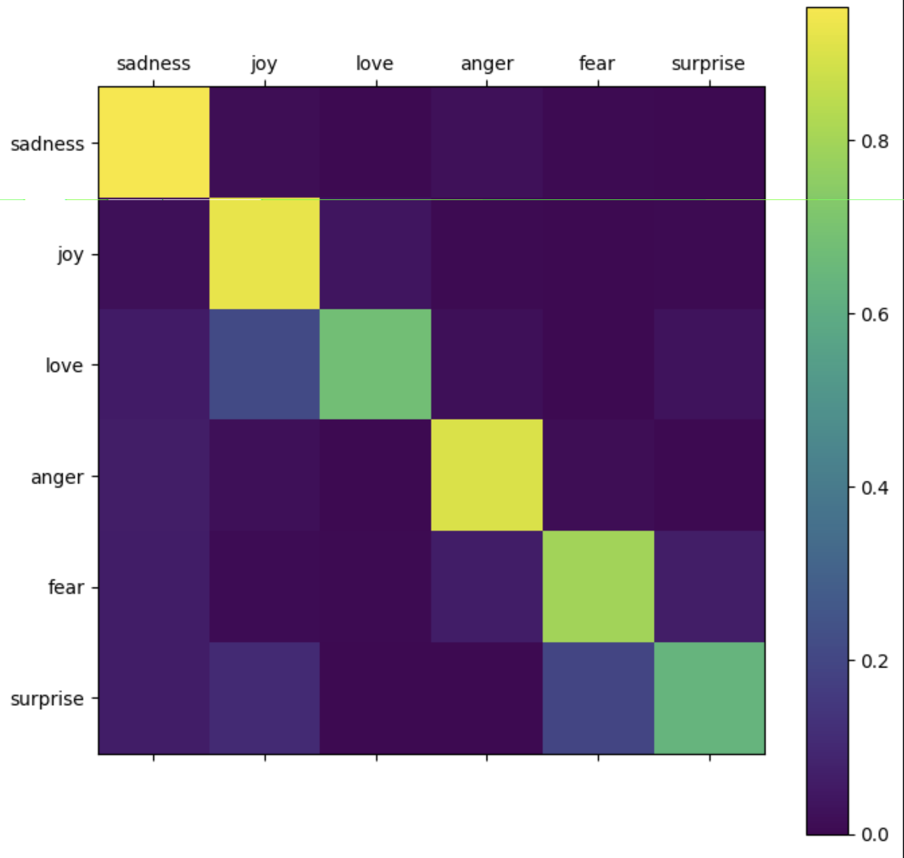

# RNN-LSTM-tweet-emotion
Deep learning model using RNN-BiLSTM to detect emotions from tweets

```
# 🧠 Tweet Emotion Recognition with TensorFlow

This project demonstrates how to build and train a **Tweet Emotion Recognition model** using **TensorFlow** and the **Hugging Face Emotion Dataset**.  
The model classifies tweets into six basic emotions: `sadness`, `joy`, `love`, `anger`, `fear`, and `surprise`.

---

## 🚀 Project Overview

This project walks through a full **Natural Language Processing (NLP)** pipeline for emotion classification on tweets:
1. **Data loading** from Hugging Face's public *emotion* dataset  
2. **Preprocessing** using Keras Tokenizer (word-to-index mapping and padding)  
3. **Model design** using a bidirectional LSTM architecture  
4. **Training and validation** with early stopping  
5. **Evaluation and visualization** using confusion matrices and performance curves

The final model achieves an accuracy of approximately **88%** on the test set.

---

## 📦 Dataset

**Source:** [Hugging Face – Emotion Dataset](https://github.com/dair-ai/emotion_dataset)

| Split | Samples | Description |
|--------|----------|--------------|
| Train | 16,000 | Used for model learning |
| Validation | 2,000 | Used for hyperparameter tuning |
| Test | 2,000 | Used for final evaluation |

Each sample is a short tweet labeled with one of six emotions.

---

## 🧩 Model Architecture

The architecture is built with TensorFlow’s `Sequential` API:

| Layer | Description |
|--------|--------------|
| **Embedding (10000, 16)** | Converts each word index into a 16-dimensional dense vector |
| **Bidirectional LSTM (20)** | Captures forward and backward dependencies in tweet sequences |
| **Bidirectional LSTM (20)** | Adds deeper contextual understanding |
| **Dense (16, softmax)** | Outputs probability distribution across 6 emotion classes |

**Loss:** `sparse_categorical_crossentropy`  
**Optimizer:** `adam`  
**Metrics:** `accuracy`

---

## ⚙️ Training Details

- **Epochs:** up to 20 (with early stopping)
- **Validation monitoring:** `val_accuracy`
- **Padding:** tweets truncated or padded to length 50
- **Vocabulary size:** 10,000 most frequent words

During training:
```

Final validation accuracy: ~0.88
Final validation loss: ~0.44

````

---

## 🧪 Evaluation

After training, the model was evaluated on the **test set (2,000 tweets)**:

```text
Test accuracy: 0.8805
Test loss: 0.4871
````

Random sample prediction:

```
Sentence: "i just want that feeling of not caring about unnecessary stuff like i felt before"
Predicted Emotion: love
```

---

## 📊 Visualizations

### 1. Training History

The `show_history()` function plots **accuracy** and **loss** across epochs for both training and validation sets, helping track convergence and overfitting.

### 2. Confusion Matrix – `heatmap_result`



This heatmap displays the model’s **classification performance per emotion**:

* **Rows** = True emotion labels
* **Columns** = Predicted emotion labels
* **Bright diagonal cells** = Correct predictions
* **Off-diagonal cells** = Misclassifications

**Interpretation:**
The matrix shows strong diagonal dominance, confirming that the model predicts most emotions correctly.
Occasional confusion occurs between semantically similar emotions — for example, *joy* and *love*, or *sadness* and *fear*, which is natural due to overlap in emotional expression.

---

## 🧰 Dependencies

Make sure the following packages are installed:

```bash
pip install tensorflow numpy matplotlib datasets
```

Optional (for Hugging Face integration):

```bash
pip install nlp
```

---

## 🧑‍💻 How to Run

1. Clone the repository:

   ```bash
   git clone https://github.com/<your-username>/tweet-emotion-recognition.git
   cd tweet-emotion-recognition
   ```
2. Open the notebook:

   ```bash
   jupyter notebook Tweet_Emotion_Recognition.ipynb
   ```
3. Run all cells or open the Colab link provided.
4. (Optional) To reproduce the final evaluation, ensure the Hugging Face dataset downloads successfully.

---

## 🧾 Credits
* **Dataset:** [dair-ai/emotion](https://github.com/dair-ai/emotion_dataset)
* **Frameworks:** TensorFlow, Keras, Hugging Face Datasets
---

